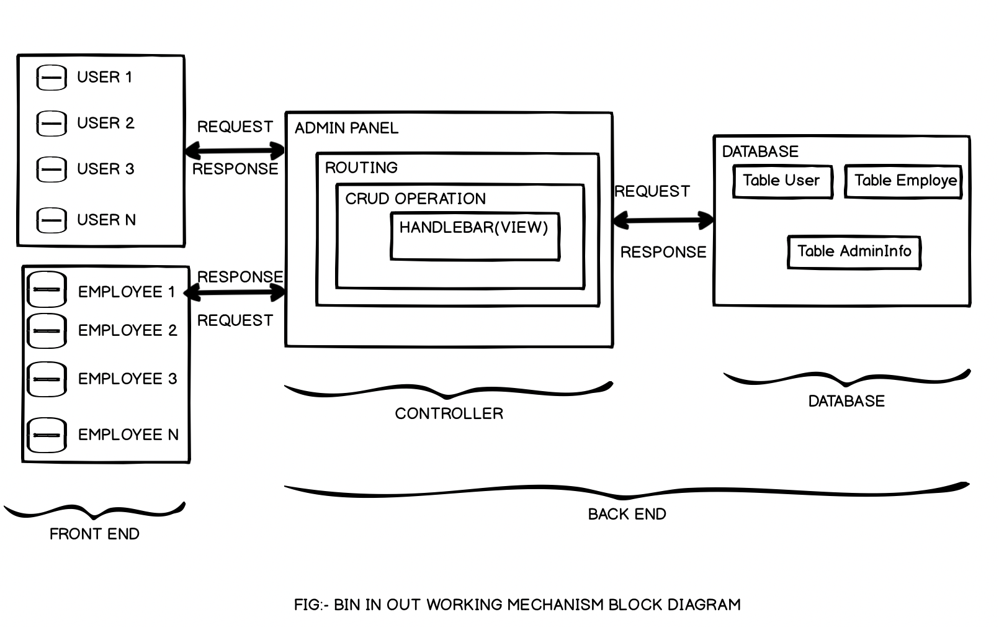

# bin-out

## Description
Bin-out is an application which allows users to submit a request for their bins to be taken out for collection when they are unable to. Once a request is sent, a local employee can choose to accept and fulfil the request. This application is useful for people who are unable to put their bins out, potentially due to being away from their property, having a physical condition or being elderly and unagile.

## User Story
Because I am unable to take my bins out,
I would like to be able to submit a request for someone to take my bins out on certain days.

WHEN a request is sent, 
THEN the address and date of request is sent to local employees.

WHEN an employee accepts a request,
THEN the request is removed from the active requests table.



## Table of Content
1. [Installation](#Installation)
2. [Database](#Database)
3. [Usage](#Usage)
4. [License](#License)
5. [Contribution](#Contribution)
6. [Tests](#Tests)
7. [Questions](#Questions)
8. [Demo](#Demo)

## Installation
The dependencies are [MySQL](https://www.npmjs.com/package/mysql) for database.
[NEXMO](https://dashboard.nexmo.com/sign-in) for sending sms to the users.
[HANDLEBARS](https://handlebarsjs.com/) for dynamically displaying data from the back-end to the front-end.
[EXPRESS](https://expressjs.com/) server for routing.
[SEQUELIZE](https://sequelize.org/) for database ORM.

Install the packages/dependencies by hitting following command on your terminal console:-
```
npm install
```

## Database
The GitHub contains a schema to help setup the database:

* **admin**:
  * **id** - INT PRIMARY KEY
  * **fullName** - VARCHAR(40) to hold full name
  * **email** - VARCHAR(30) to hold email address
  * **password** - VARCHAR(30) to hold password

* **user**:
  * **id** - INT PRIMARY KEY
  * **fullName** -  VARCHAR(40) not null to hold customer full name
  * **unitNumber** -  INT  to hold unit number default null
  * **houseNumber** -  INT not null to hold house number
  * **streetName** -  VARCHAR(30) not null to hold street name
  * **postcode** -  INT not null to hold postcode
  * **proofOfAddress** -  VARCHAR(50) not null to hold proof of address
  * **request** -  BOOLEAN not null Default false to hold request from customer 
  * **customer admin id** - INT  not null foreign key

* **employee**:
  * **id** - INT PRIMARY KEY
  * **fullName** -  VARCHAR(40) to hold customer full name
  * **email** - VARCHAR(30) unique not null to hold email address
  * **password** - VARCHAR(30) not null to hold password
  * **address** - VARCHAR(30) not null to hold full address 
  * **proofOfId** -  VARCHAR(50) not null to hold proof of id
  * **accept request** -  BOOLEAN not null Default false
  * **Request completed** -  BOOLEAN not null Default false
  * **Employee customer ID** -  INT not null foreign key
  * **employee admin id** -  INT not null foreign key


## Usage
This application works on the basis of following block diagram:

**Step 1:** <br>
I) Customer/User Sign-up: <br>
A Customer/User can signup for an account by enterring the follwing information:
  * **Full Name**
  * **Unit Number (if applicable)** 
  * **House Number**
  * **Street Name** 
  * **Postcode** 
  * **Phone Number** 

II) Employee/Helper Sign-up: <br>
Anyone can become an Employee/Helper by signing up using the following information:
  * **Full Name**
  * **Email**
  * **Password**
  * **Address** 
  
III) Admin Panel:
  - Admins are responsible for checking new user and employee signups, and verifying their data is correct. 
  - Admins can approve or reject new signup requests, based on the verifcation.
  - If a new user's signup has been successfully approved, a personal unique User ID will be sent to the phone number they signed up with.
  - If a new user's signup was rejected, they will get an unsuccessful message sent to the phone number they signed up with.
  - If an employee has been approved by an admin, they will will be able to login to the employee portal with their username and password, where they can see a table of active bin requests.

**Step 2:** <br>
  I) Bin Requests From User:
  - User's will be able to send requests for their bins to be taken out using their unique User ID, selecting a date from a calendar and by clicking the "Request" button.

  II) Admin will be Automatic controller.
  - Admin will receive the request, will search information in the database with the help of unique id of user. If it finds matching user goes next step otherwise sends message with "no customer found".
  - If it finds matching user it will search employee and send all the details about user to the employee logged in portal.Otherwise admin will send message to user as no matching helper found try next time.
  
  III) Employee's Accepting the Bin Requests:
  - If an Employee/Helper sees a notification on their page for a new bin request, they will be able to click a button to accept the request.
  - Once they have accepted the request, the database table will be updated to show that they have accepted the request.
  - The job will then be appended on their task list with progress.
  - Once the job has been completed, the Employee can press the job completed button so that record cna be updated on the table.
  
## License
```
This is MIT license
```

## Contribution
```
When contributing to this repository, please first discuss the change you wish to make via issue, email, or any other method with the owner of this repository before making a change.
```

## Tests
Testing was completed using node.js and express before deploying finished application on Heroku.

## Questions
- Benjamin Turnbull: </br>
 GitHub: <a href="https://github.com/marasinipradeep">https://github.com/benorule</a> </br>
 Email: <a href="marasinipradeep@gmail.com">benorule@outlook.com</a>

- Anjini Krishnan </br>
 GitHub: <a href="https://github.com/marasinipradeep">https://github.com/anjkrish2608</a> </br>
 Email: <a href="marasinipradeep@gmail.com">anjini.krishnan@hotmail.com</a>

- Pradeep Marasini </br>
 GitHub: <a href="https://github.com/marasinipradeep">https://github.com/marasinipradeep</a> </br>
 Email: <a href="marasinipradeep@gmail.com">marasinipradeep@gmail.com</a>

- Chris Roschi </br>
 GitHub: <a href="https://github.com/marasinipradeep">https://github.com/cr-53</a> </br>
 Email: <a href="marasinipradeep@gmail.com">chrisroschi53@gmail.com</a>

  
## Demo
<a href="https://youtu.be/KxiwXnkHCB8">Click here for a video demo</a>

## Credits

* [Ben Turnbull](http://www.github.com/benorule)
* [Anjini Krishnan](http://www.github.com/anjkrish2608)
* [Pradeep Marasini](http://www.github.com/marasinipradeep)
* [Chris Roschi](http://www.github.com/CR-53)